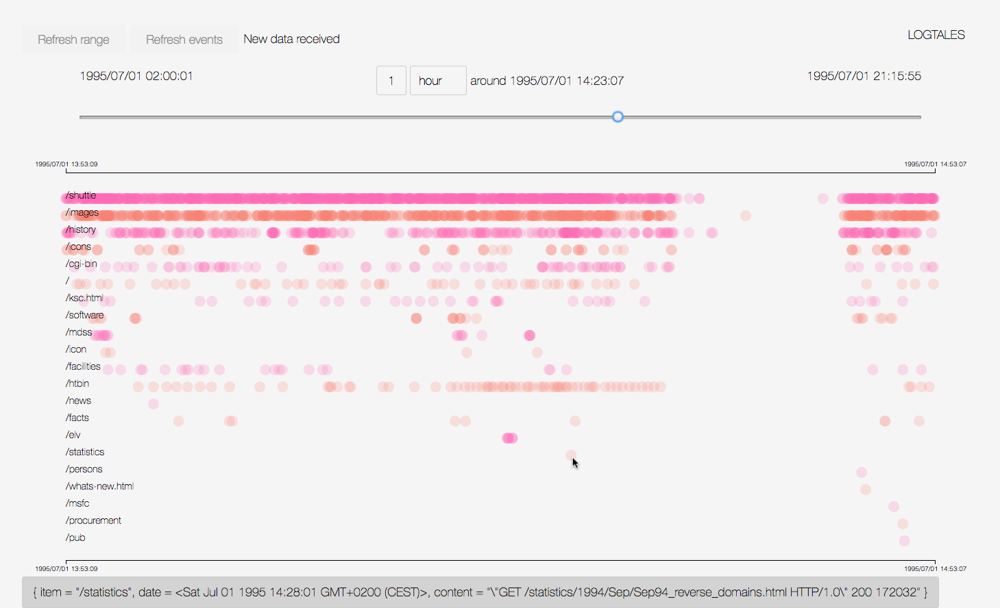

# Logtales

Logtales lets you visualize log events grouped per item on a timeline. Let it tell you the tales of your application, found in their logs.



## Dependencies
- Elixir 1.5, see `back/mix.exs` for packages
- Elm 0.18, see `front/elm-package.json` for packages

## Run the demo example
Displays events from a subset of the [July 1995 NASA Kennedy Space Center WWW server log](http://ita.ee.lbl.gov/html/contrib/NASA-HTTP.html).
```bash
bin/demo.bash
```
Note: this resets the existing events database and retrieves Elixir backend dependencies.

## How to use
- Configure the backend (see Configure section)
- Get backend dependencies with `cd back; mix deps.get; cd ..` (This is unnecessary if `bin/demo.bash` was run previously)
- Load log file into database with `bin/load.bash`
- Start the backend and the frontend with `bin/run.bash`
- Open http://localhost:8000
- Click on `Refresh range` to get available date range
- Use the slider to travel through time

## Configure
- Set the `file` value in the `:logtales` config in `back/config/config.exs` to the path of your log file
- Set the `regex` value in the `:logtales` config in `back/config/config.exs`. This is an elixir regex that *must* contain three named capture groups: date, item and content. It is used for both filtering log events and finding the date, item and content of event that will be displayed. For example, for a log whose lines are like
```
[2017-01-01 23:00:00] [an item] blah blah blah
[2017-01-02 00:05:00] [another item] blah blah blah
[2017-01-02 00:05:00] [an item] blah blah blah
```
the regex may be
```
~r/^\[(?<date>\d\d\d\d-\d\d-\d\d \d\d:\d\d:\d\d)\] \[(?<item>[^\]]+)\] (?<content>.*)/
```
The item can be anything meaningful for you to group events when plotting them on a timeline. Events of the same item will be displayed on one line, there will be one line per item. For example if your logs are authentication logs and the application prints some events with a username in it, you can use the username as item. As a result there will be one line per username on the timeline plot.
- Set the `date_format` value in the `:logtales` config in `back/config/config.exs` to the [Timex format](https://hexdocs.pm/timex/Timex.Format.DateTime.Formatters.Default.html#content) to use to parse dates captured by the `regex`.

## Start the application
```bash
# If Elixir dependencies were never retrieved, first do
cd back
mix deps.get
cd ..

bin/run.bash
```
This starts the backend at http://localhost:4000 and the frontend at http://localhost:8000.

## Load the log file into database
This resets the existing database and loads events from the configured file
```bash
bin/load.bash
```

## Run the tests
### Backend
```bash
cd back
mix test
```
